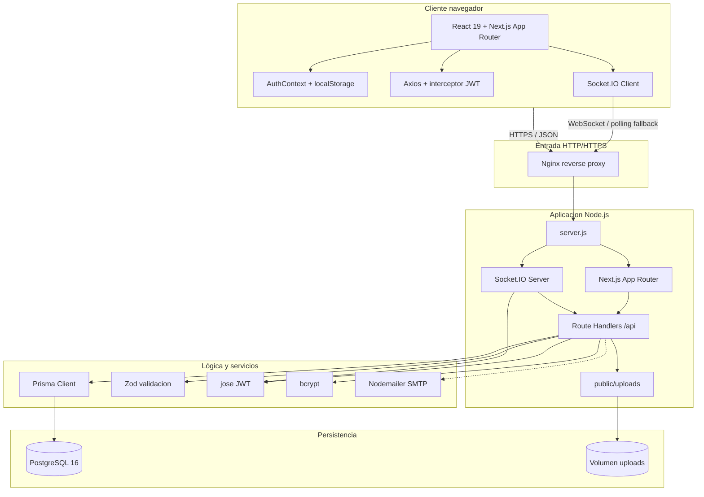
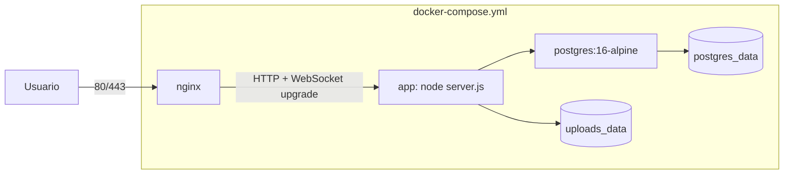

# Diagrama de arquitectura del sistema

Arquitectura general del proyecto Taekwondo MGG: cliente web, servidor Next.js personalizado, realtime con Socket.IO, persistencia PostgreSQL y despliegue Docker/Nginx.

---

## Vista general (Mermaid)

---

## Contenedores de produccion

---

## Capas resumidas

| Capa | Contenido |
|------|-----------|
| **Cliente** | React 19, Next.js App Router, AuthContext, Axios, Socket.IO Client, Tailwind, shadcn/ui |
| **Entrada** | Nginx en produccion, HTTPS, certificados Let's Encrypt y soporte WebSocket |
| **Servidor Node** | `server.js`, Next.js, Route Handlers bajo `/api/*`, Socket.IO Server |
| **Logica de negocio** | Zod, Prisma, JWT con `jose`, bcrypt, middleware `requireAuth`/`requireRole` |
| **Persistencia** | PostgreSQL, Prisma migrations, volumen Docker para datos |
| **Archivos** | `public/uploads` para avatares, imagenes de grupo y documentos |
| **Externo** | SMTP mediante Nodemailer para recuperacion de contraseña |

---

## Flujo de una peticion HTTP

1. El usuario interactua con la UI React.
2. Axios envia la peticion al mismo origen con `Authorization: Bearer <access>` cuando procede.
3. En produccion, Nginx reenvia la peticion a `server.js`; en desarrollo, el navegador llama directamente a `localhost:3000`.
4. Next.js ejecuta el Route Handler correspondiente en `src/app/api/**/route.ts`.
5. El handler valida con Zod, comprueba autenticacion/rol, y usa Prisma para leer o escribir en PostgreSQL.
6. Si hay uploads, se guarda el archivo en `public/uploads` y la metadata en PostgreSQL.
7. La respuesta JSON vuelve al cliente; si hay un 401, el interceptor intenta refrescar tokens.

## Flujo realtime

1. El cliente abre una conexion Socket.IO usando el access token.
2. `server.js` valida el token con `jose` y registra el socket en salas `conversation:{id}`.
3. Los mensajes se persisten mediante los Route Handlers y se emiten eventos Socket.IO.
4. Si WebSocket no esta disponible, Socket.IO puede usar polling como fallback de transporte.
