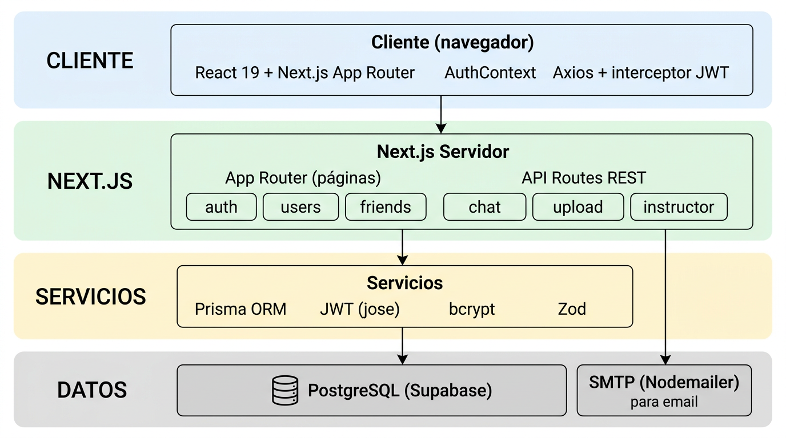
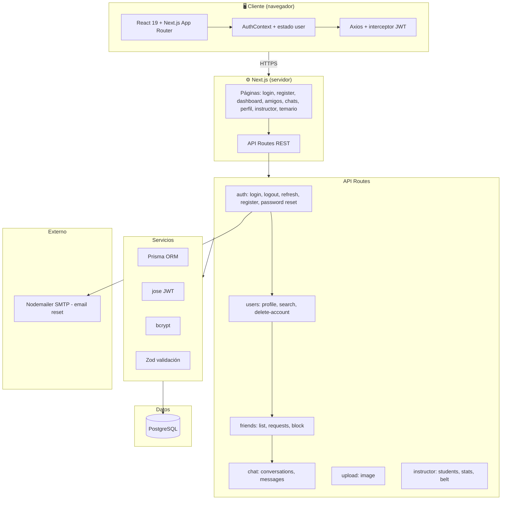
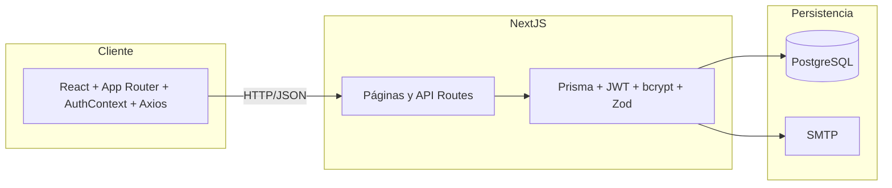

# Diagrama de arquitectura del sistema

Arquitectura general del proyecto Taekwondo MGG: capas, tecnologías y flujo de datos en una única vista.

---

## Vista en una única imagen

*Figura 1: Capas del sistema (Cliente → Next.js → Servicios → PostgreSQL + SMTP).*

---

## Vista general (Mermaid)

El siguiente diagrama Mermaid resume la arquitectura en un solo bloque. Debajo se incluye una **versión simplificada** para que quepa bien en una única imagen al exportar o en documentación.

---

## Versión compacta (para una única imagen)

Diagrama simplificado en tres capas para exportar o incrustar como una sola figura.

---

## Capas resumidas

| Capa | Contenido |
|------|-----------|
| **Cliente** | Next.js (React 19), App Router, AuthContext, Axios con interceptor de tokens, Tailwind, Radix UI |
| **Next.js servidor** | Páginas (públicas/privadas), API Routes bajo `/api/*` |
| **Lógica de negocio** | Validación Zod, Prisma, JWT (jose), bcrypt, requireAuth/requireRole |
| **Persistencia** | PostgreSQL, tabla RefreshToken, PasswordResetToken, User, etc. |
| **Externo** | Nodemailer (SMTP) para envío de emails de recuperación de contraseña |

---

## Flujo de una petición típica

1. **Usuario** interactúa con la UI (React).
2. **AuthContext** mantiene `user` y tokens en memoria; **Axios** añade `Authorization: Bearer <access>`.
3. La petición llega a **Next.js** (mismo origen): si es página, se renderiza; si es `/api/*`, se ejecuta el route handler.
4. El **route** valida con Zod, opcionalmente usa **requireAuth** (JWT), y usa **Prisma** para leer/escribir en **PostgreSQL**.
5. Si hace falta enviar email (reset contraseña), se llama a **Nodemailer** (SMTP).
6. La respuesta JSON vuelve al **cliente**; si es 401, el interceptor intenta **refresh** y reintenta.
