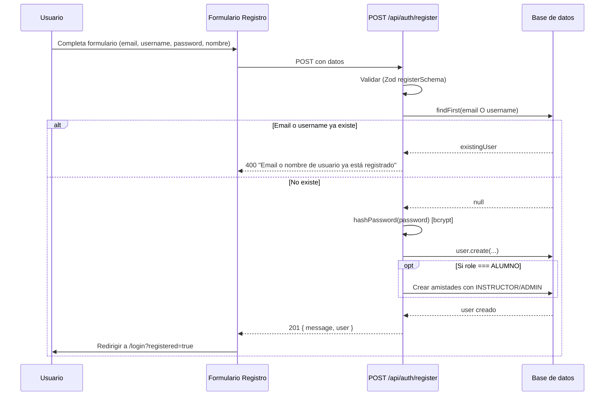
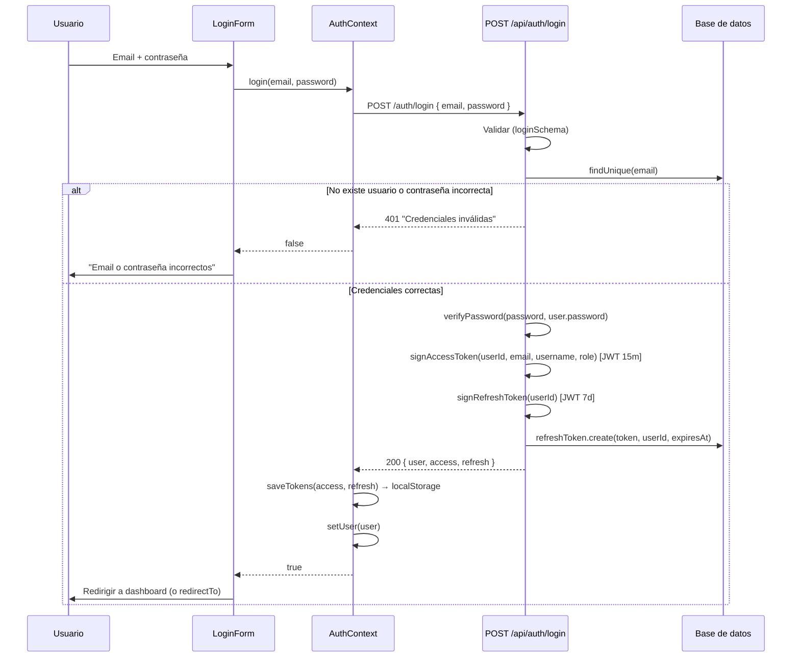
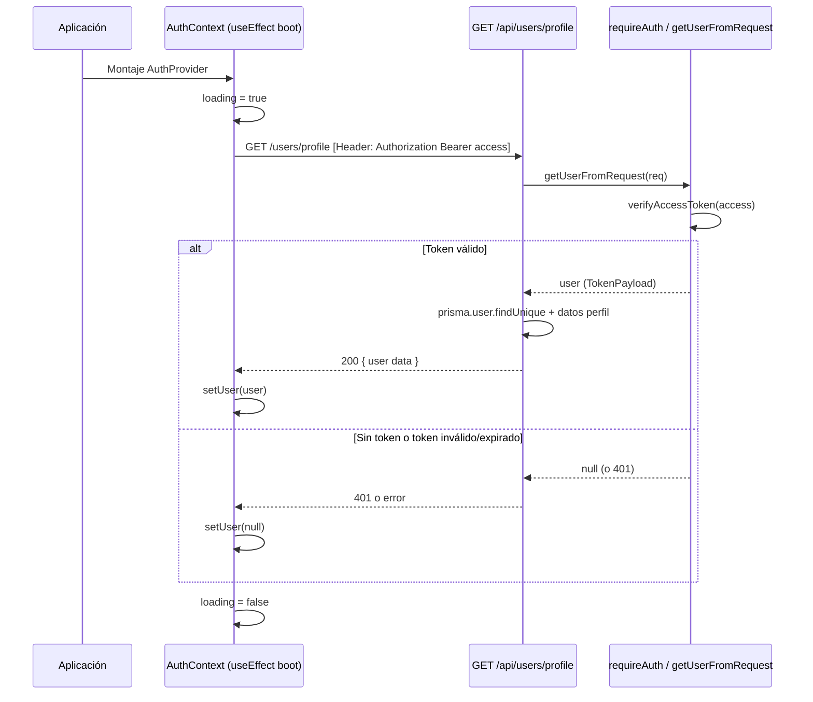
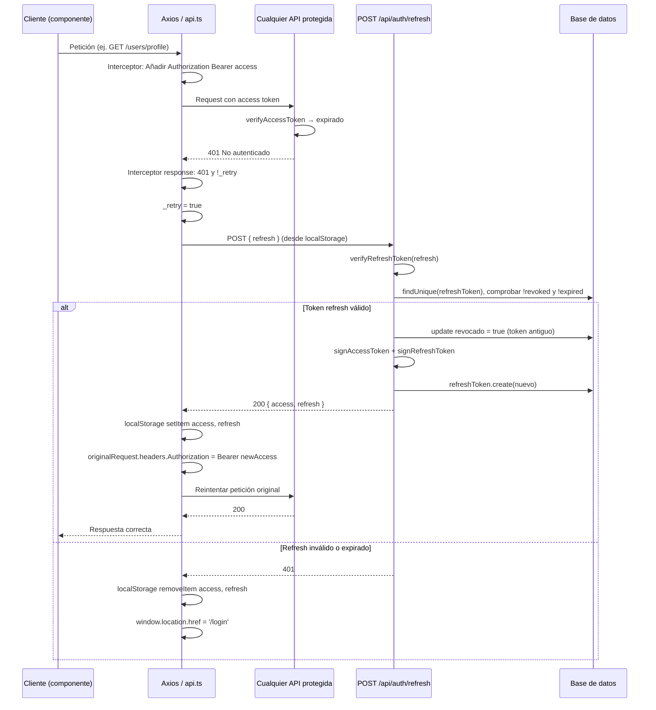
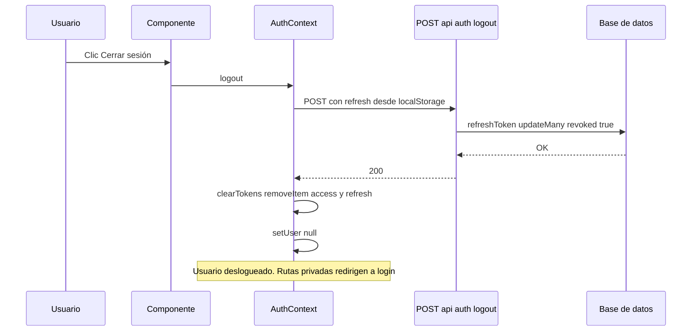
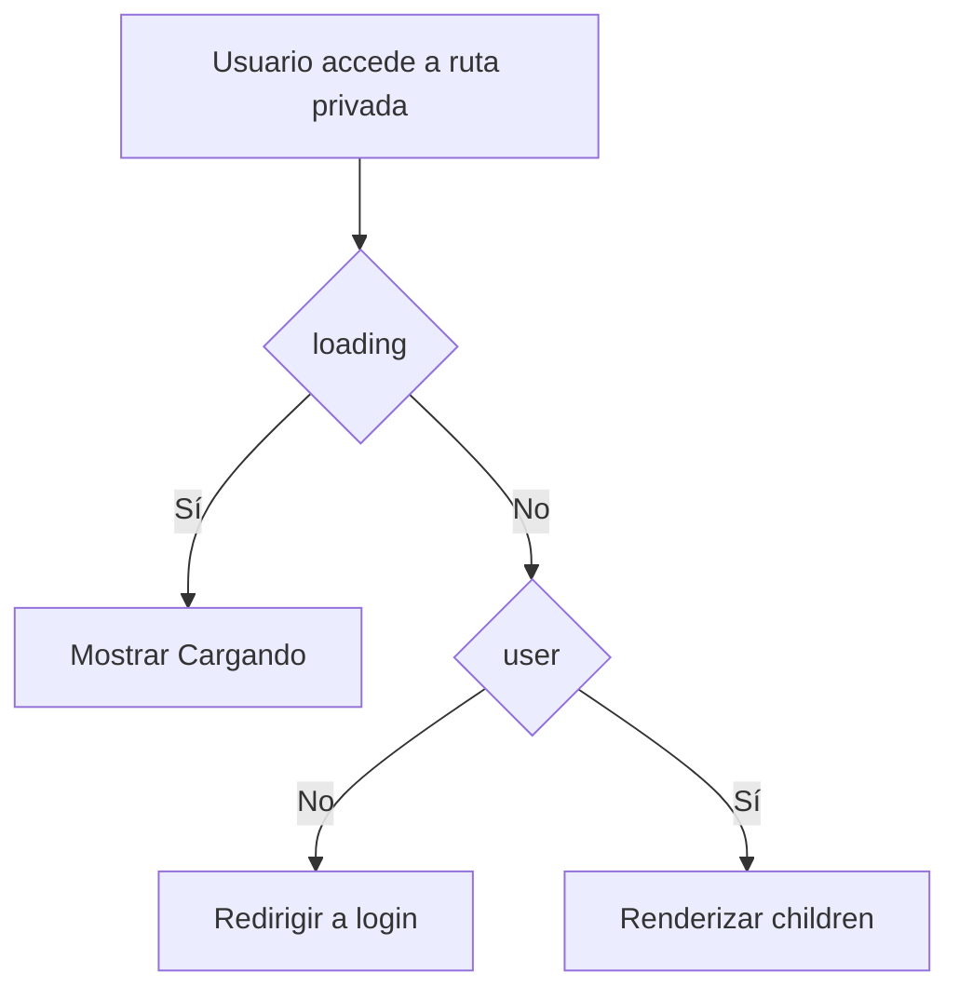
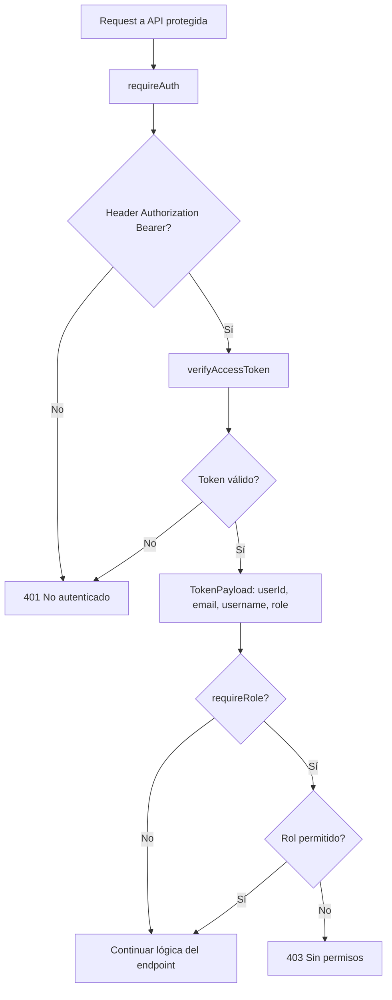
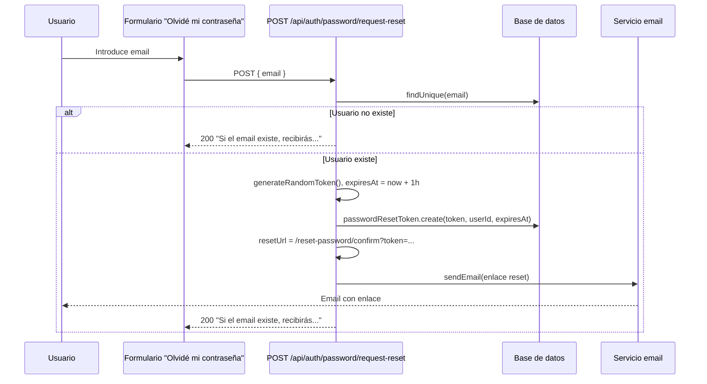
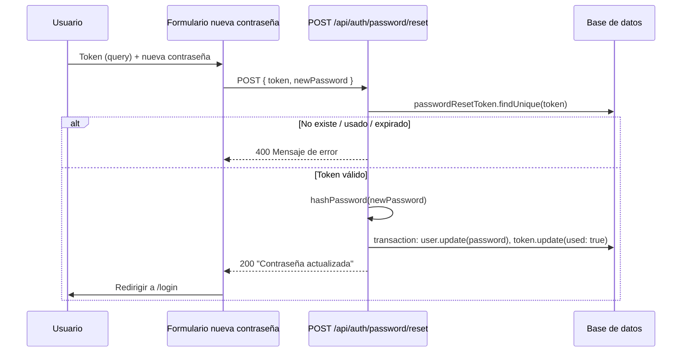

# Diagrama del proceso de autenticación

Este documento describe el flujo de autenticación del proyecto Taekwondo MGG mediante diagramas en Mermaid.

---

## 1. Registro de usuario

El usuario envía email, username, contraseña y nombre. El backend valida, comprueba que no exista el email/username, hashea la contraseña con bcrypt y crea el usuario. Si el rol es ALUMNO, se crean amistades automáticas con todos los INSTRUCTOR y ADMIN.

---

## 2. Login

El usuario introduce email y contraseña. El backend busca el usuario, verifica la contraseña con bcrypt, genera un JWT de acceso (15 min) y un refresh token (7 días), guarda el refresh en la base de datos y devuelve usuario + tokens. El cliente guarda los tokens en `localStorage` y el usuario en el estado del `AuthContext`.

---

## 3. Recuperación de sesión al arrancar

Al cargar la aplicación, el `AuthProvider` intenta recuperar la sesión llamando a `GET /users/profile` con el access token en el header `Authorization`. Si la respuesta es correcta, se establece el usuario; si no hay token o falla, el usuario queda en `null`.

---

## 4. Refresh de tokens (interceptor)

Cuando una petición API devuelve 401 (access token expirado), el interceptor de Axios intenta renovar los tokens con el refresh token. Si tiene éxito, guarda los nuevos y reintenta la petición original; si falla, limpia tokens y redirige a `/login`.

---

## 5. Logout

El usuario cierra sesión. El cliente envía el refresh token al backend para revocarlo en la base de datos y localmente elimina tokens y usuario del estado.

---

## 6. Protección de rutas privadas (frontend)

Las rutas bajo el dashboard usan `PrivateRoute`. Si el usuario no está autenticado (y la carga inicial ha terminado), se redirige a `/login`.

---

## 7. Protección de rutas API (backend)

Las rutas API que requieren autenticación usan `requireAuth(req)`, que extrae el token del header `Authorization: Bearer <token>` y lo verifica con `verifyAccessToken`. Si no hay token o es inválido, responden 401.

---

## 8. Recuperación de contraseña

Flujo en dos pasos: solicitud (envío de email con enlace) y confirmación (nueva contraseña con token).

### 8.1 Solicitud de reset

### 8.2 Confirmación (nueva contraseña)

---

## Resumen de componentes

| Componente | Ubicación | Función |
|------------|-----------|---------|
| **AuthContext** | `src/context/AuthContext.tsx` | Estado global user, login(), logout(), recuperación de sesión |
| **api (Axios)** | `src/lib/api.ts` | Interceptor: añade Bearer token, refresh en 401, redirección a login |
| **auth-helpers** | `src/lib/auth-helpers.ts` | hashPassword, verifyPassword, JWT sign/verify, getUserFromRequest |
| **requireAuth** | `src/server/middleware/auth.ts` | Middleware para rutas API; requireRole para comprobar rol |
| **PrivateRoute** | `src/components/PrivateRoute.tsx` | Redirige a /login si no hay user |
| **Login** | `src/app/api/auth/login/route.ts` | POST login, genera access + refresh, guarda refresh en BD |
| **Logout** | `src/app/api/auth/logout/route.ts` | POST revoca refresh token en BD |
| **Refresh** | `src/app/api/auth/refresh/route.ts` | POST intercambia refresh por nuevos access + refresh |
| **Register** | `src/app/api/auth/register/route.ts` | POST registro, bcrypt, amistades ALUMNO |
| **Request reset** | `src/app/api/auth/password/request-reset/route.ts` | POST genera token y envía email |
| **Reset** | `src/app/api/auth/password/reset/route.ts` | POST token + newPassword, actualiza contraseña |

---

## Tokens y almacenamiento

- **Access token**: JWT, 15 min, secret `JWT_SECRET`. Se envía en `Authorization: Bearer <access>`.
- **Refresh token**: JWT, 7 días, secret `JWT_REFRESH_SECRET`. Se guarda en BD (tabla `RefreshToken`) y en `localStorage`; se usa solo en `/auth/refresh` y `/auth/logout`.
- **Almacenamiento cliente**: `localStorage` con claves `access` y `refresh` (y opcionalmente `mock_user` si `NEXT_PUBLIC_USE_MOCK_AUTH=1`).
