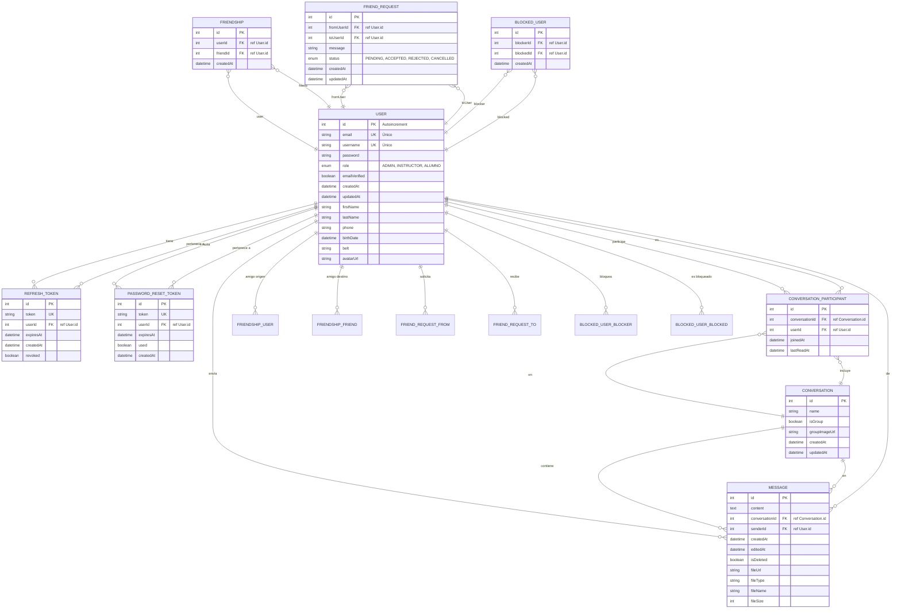
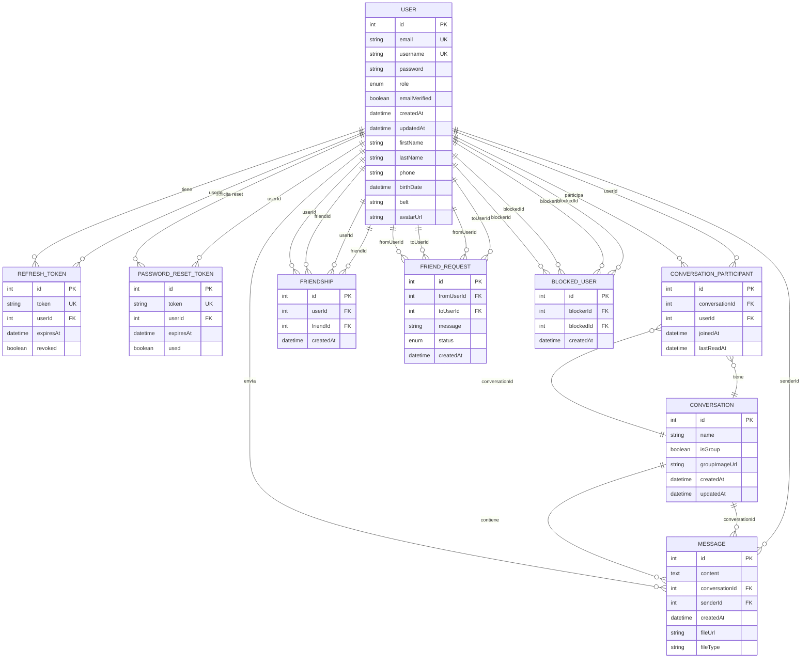

# Diagrama Entidad-Relación del sistema

Diagrama ER del proyecto Taekwondo MGG: entidades, claves primarias (PK), claves foráneas (FK) y cardinalidades. Basado en el schema de Prisma (`prisma/schema.prisma`).

---

## Diagrama ER (Mermaid)

En Mermaid, las relaciones con el mismo nombre de entidad se distinguen por el rol. Para evitar ambigüedad con **User** y las tablas que lo referencian dos veces (Friendship, FriendRequest, BlockedUser), abajo se muestra una versión simplificada por bloques funcionales.

---

## Diagrama ER simplificado por módulos

Misma estructura pero agrupada por área (autenticación, chat, amistades) para leer mejor en GitHub.

---

## Resumen de entidades, PK, FK y cardinalidades

| Entidad | Clave primaria | Claves foráneas | Cardinalidades |
|--------|----------------|-----------------|----------------|
| **User** | `id` | — | 1:N con RefreshToken, PasswordResetToken, ConversationParticipant, Message, Friendship (como user y friend), FriendRequest (from/to), BlockedUser (blocker/blocked) |
| **RefreshToken** | `id` | `userId` → User.id | N:1 User |
| **PasswordResetToken** | `id` | `userId` → User.id | N:1 User |
| **Conversation** | `id` | — | 1:N ConversationParticipant, 1:N Message |
| **ConversationParticipant** | `id` | `conversationId` → Conversation.id, `userId` → User.id | N:1 Conversation, N:1 User. UK(conversationId, userId) |
| **Message** | `id` | `conversationId` → Conversation.id, `senderId` → User.id | N:1 Conversation, N:1 User |
| **Friendship** | `id` | `userId` → User.id, `friendId` → User.id | N:1 User (origen), N:1 User (destino). UK(userId, friendId) |
| **FriendRequest** | `id` | `fromUserId` → User.id, `toUserId` → User.id | N:1 User (from), N:1 User (to). UK(fromUserId, toUserId) |
| **BlockedUser** | `id` | `blockerId` → User.id, `blockedId` → User.id | N:1 User (bloqueador), N:1 User (bloqueado). UK(blockerId, blockedId) |

---

## Notación de cardinalidad (Mermaid)

- `||--o{` : uno a muchos (0..n)
- `}o--||` : muchos a uno (n..1)
- `||--||` : uno a uno (1..1)
- **PK** = Primary Key  
- **FK** = Foreign Key  
- **UK** = Unique (atributo o par único en la BD)

En Prisma, todas las relaciones de estas tablas usan `onDelete: Cascade`: al borrar un User se eliminan sus RefreshToken, PasswordResetToken, participaciones, mensajes, amistades, solicitudes y bloqueos asociados.
