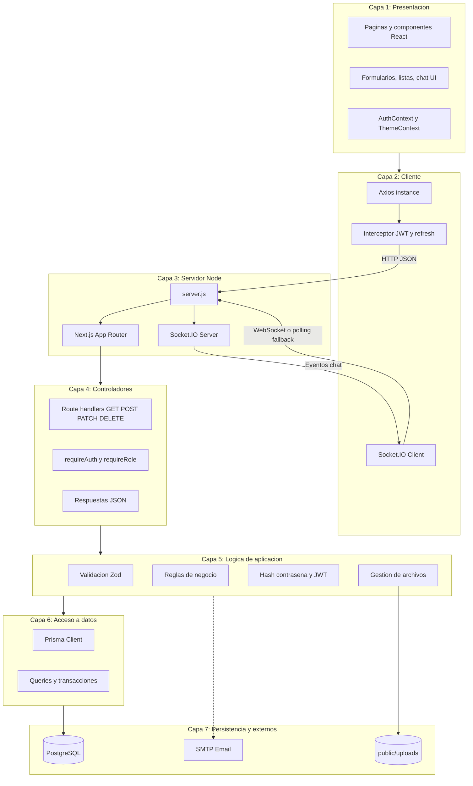
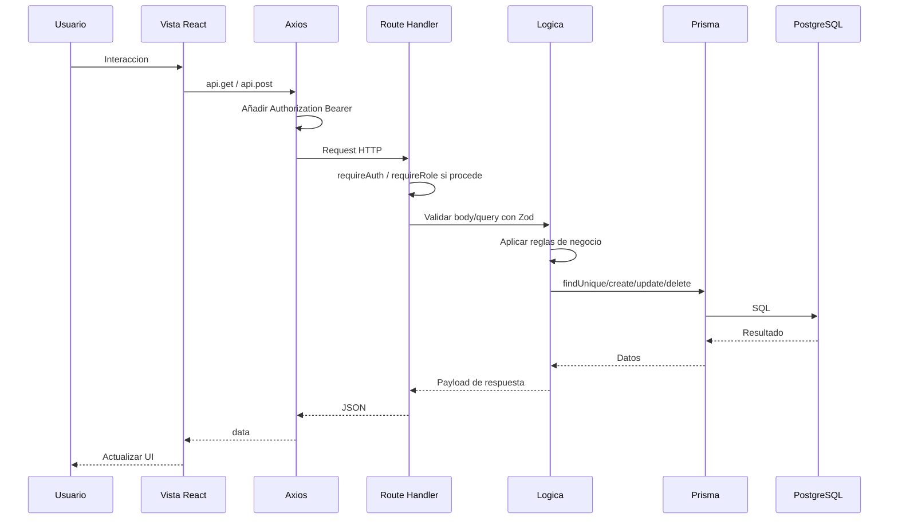
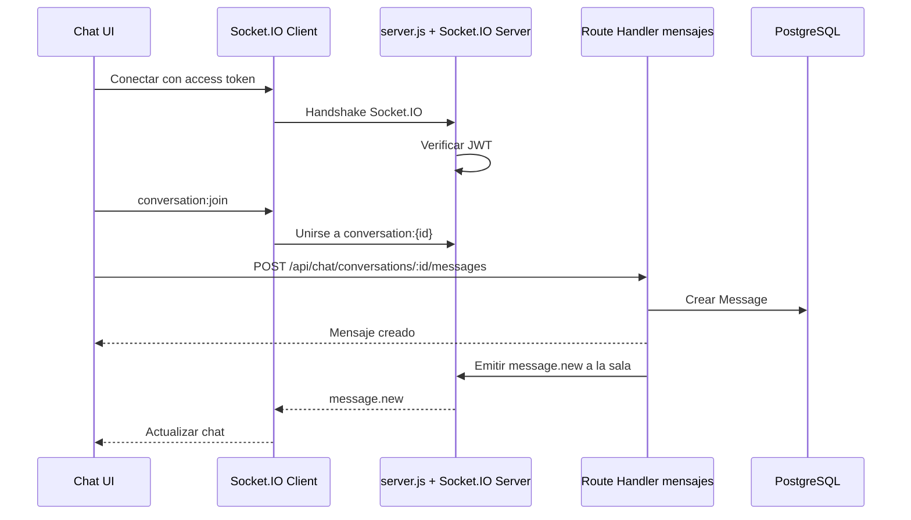
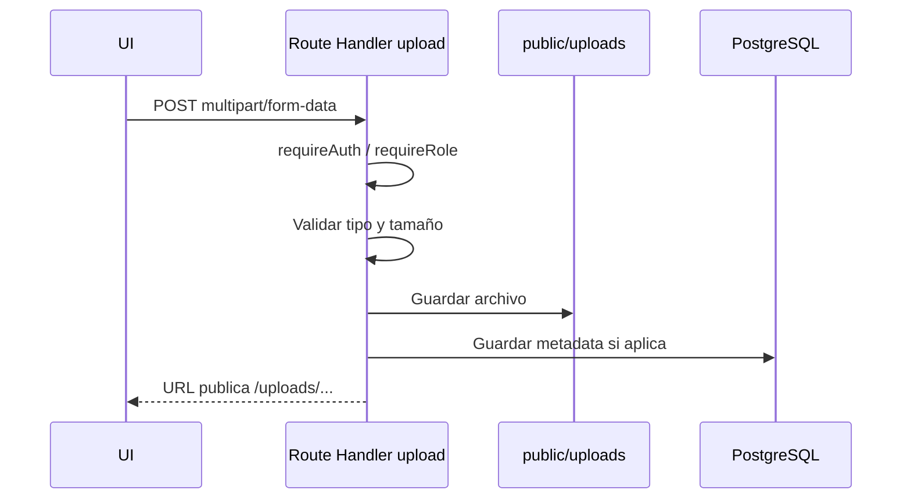

# Logica por capas y flujo de datos

Documento que describe la arquitectura en capas del proyecto Taekwondo MGG y el flujo de datos entre cliente, servidor, realtime, base de datos y almacenamiento local.

---

## 1. Diagrama de logica por capas

---

## 2. Responsabilidades por capa

| Capa | Responsabilidad | Tecnologias / Ubicacion |
|------|-----------------|-------------------------|
| **Presentacion** | Mostrar UI, capturar acciones, mantener estado de sesion y tema | React, App Router, componentes en `src/app` y `src/components` |
| **Cliente** | Peticiones HTTP autenticadas, refresh de tokens y conexion realtime | Axios en `src/lib/api.ts`, Socket.IO Client en `src/hooks/useChatSocket.tsx` |
| **Servidor Node** | Ejecutar Next.js y Socket.IO sobre el mismo servidor HTTP | `server.js` |
| **Controladores** | Recibir requests, validar auth/rol y devolver JSON | Route Handlers en `src/app/api/**/route.ts`, `src/server/middleware/auth.ts` |
| **Logica de aplicacion** | Validar datos, aplicar reglas, hashear contraseñas, firmar/verificar JWT, gestionar uploads | Zod, bcrypt, jose, codigo dentro de handlers y libs |
| **Acceso a datos** | Leer y escribir en la base de datos | Prisma Client en `src/lib/prisma.ts` |
| **Persistencia y externos** | Guardar datos, guardar archivos y enviar correos | PostgreSQL, `public/uploads`, Nodemailer SMTP |

---

## 3. Flujo HTTP tipico

---

## 4. Flujo realtime de chat

Socket.IO usa WebSocket cuando esta disponible y puede caer a polling como transporte de respaldo.

---

## 5. Flujo de uploads

Los avatares, imagenes de grupo y documentos se almacenan localmente bajo `public/uploads`. En produccion ese directorio se monta como volumen Docker.

---

## 6. Reglas de la arquitectura

- La UI no accede directamente a Prisma ni a PostgreSQL.
- Las escrituras de negocio pasan por Route Handlers y validacion.
- Socket.IO se usa para eventos realtime, pero la persistencia de mensajes sigue pasando por la API y PostgreSQL.
- Los archivos se guardan en filesystem local y su URL/metadata se persiste cuando corresponde.
- Los servicios externos, como SMTP, se invocan desde la logica de aplicacion.
