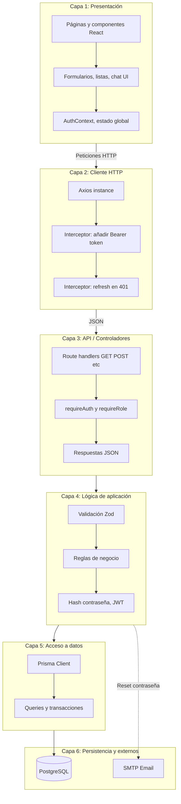
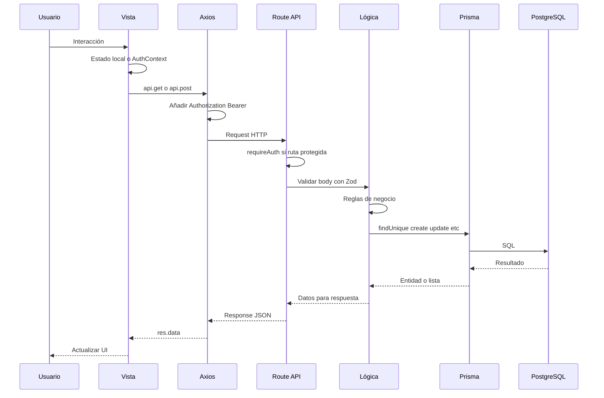
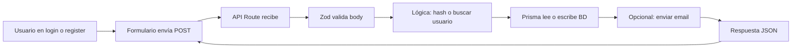
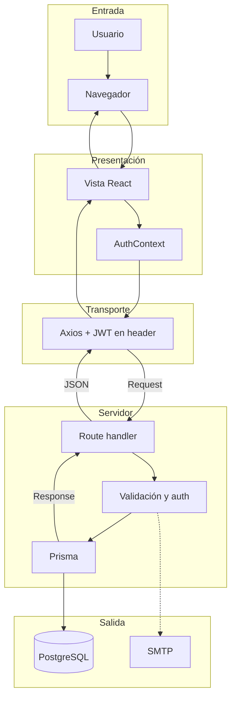

# Lógica por capas y flujo de datos

Documento que describe la **arquitectura en capas** del proyecto Taekwondo MGG y el **flujo de datos** entre ellas.

---

## 1. Diagrama de lógica por capas

El sistema se organiza en capas; cada una solo se comunica con la capa inferior (o con servicios externos). No se salta capas.

---

## 2. Responsabilidades por capa

| Capa | Responsabilidad | Tecnologías / Ubicación |
|------|-----------------|-------------------------|
| **Presentación** | Mostrar UI, capturar acciones del usuario, mantener estado de sesión (user) | React, App Router, AuthContext, componentes en `src/app`, `src/components` |
| **Cliente HTTP** | Enviar peticiones con credenciales, reintentar con refresh si 401 | Axios, `src/lib/api.ts` |
| **API / Controladores** | Recibir request, decidir si requiere auth/rol, delegar en lógica y devolver respuesta | Route handlers en `src/app/api/**/route.ts`, `src/server/middleware/auth.ts` |
| **Lógica de aplicación** | Validar entrada, aplicar reglas (ej. amistades ALUMNO), hashear contraseñas, firmar/verificar JWT | Zod, bcrypt, jose, código dentro de los route handlers |
| **Acceso a datos** | Leer y escribir en la base de datos de forma estructurada | Prisma, `src/lib/prisma.ts`, modelos en `prisma/schema.prisma` |
| **Persistencia y externos** | Almacenar datos y enviar correos | PostgreSQL, Nodemailer (SMTP) |

---

## 3. Flujo de datos (entrada: petición del usuario)

Flujo típico cuando el usuario hace una acción que requiere datos del servidor (por ejemplo ver perfil o enviar mensaje).

---

## 4. Flujo de datos (entrada: petición pública)

Páginas o APIs que no requieren autenticación (login, register, solicitar reset de contraseña).

---

## 5. Flujo de datos (resumen en una vista)

Diagrama único que resume capas y sentido del flujo de datos.

---

## 6. Reglas de la arquitectura en capas

- **Flujo descendente**: la presentación llama al cliente HTTP; el cliente HTTP llama a la API; la API usa lógica de aplicación; la lógica usa acceso a datos; el acceso a datos escribe o lee en persistencia.
- **Sin saltos**: la presentación no llama directamente a Prisma ni a la base de datos; siempre pasa por la API.
- **Datos de vuelta**: la respuesta fluye en sentido inverso (DB → Prisma → lógica → route → JSON → Axios → vista → usuario).
- **Excepciones**: la capa de lógica puede llamar a servicios externos (SMTP) sin pasar por la capa de acceso a datos cuando la operación no es persistencia (ej. envío de email).

Con esto se tiene una vista clara de la **lógica por capas** y del **flujo de datos** en el sistema.
